# GARNET & BEDROCK AGENT

## Prerequisites

* AWS account , programmatic and console access
* Bedrock in  us-east-1 . Indeed as of writing the Bedrock agent features has not been yet rolled out in all regions. 


This tutorial is based on the `BikeHireDockingStation` Smart Data Model: https://github.com/smart-data-models/dataModel.Transportation/tree/4df15072b13da6c7bd7e86915df91fb28921aa7f/BikeHireDockingStation

You can of course easily update this example to suit other Data Model

Few Links about Garnet and Smart Data Model:

https://garnet-framework.dev/  
https://github.com/awslabs/garnet-framework  
https://github.com/smart-data-models  


## What is Bedrock agent

https://docs.aws.amazon.com/bedrock/latest/userguide/agents.html

 The agent helps your end-users complete actions based on organization data and user input. Agents orchestrate interactions between foundation models, data sources, software applications, and user conversations, and automatically call APIs to take actions and invoke knowledge bases to supplement information for these actions. Developers can easily integrate the agents and accelerate delivery of generative AI applications saving weeks of development effort.


<p>
    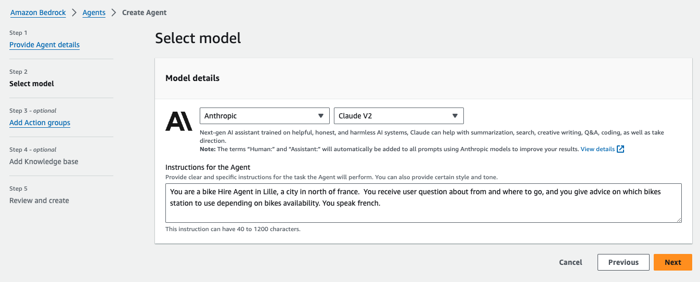
</p>


### ReAct Prompting

FMs determine how to solve user-requested tasks with a technique called ReAct . It’s a general paradigm that combines reasoning and acting with FMs. ReAct prompts FMs to generate verbal reasoning traces and actions for a task. This allows the system to perform dynamic reasoning to create, maintain, and adjust plans for acting while incorporating additional information into the reasoning. The structured prompts include a sequence of question-thought-action-observation examples.

* The question is the user-requested task or problem to solve.
* The thought is a reasoning step that helps demonstrate to the FM how to tackle the problem and identify an action to take.
* The action is an API that the model can invoke from an allowed set of APIs.
* The observation is the result of carrying out the action.


In fact we will use bedrock agent as a reasoning AI

* It means that we will provide the necessary API call to the different systems. The AI will choose the best option
* In our example: for instance let say we are in the Lille EUROPE train station and we want the name of the closest bike station:
* After processing the user prompt the Agent will decide to call the geocoding API to first get the coordinates of Lille EUROPE train station
* Then it will be able call garnet with the geo-queries capabilities (using the coordinates it got from the previous step) , and get the details for the appropriate station.
* He will then be able to generate an answer to the user in a natural language

1. You can create an agent with Bedrock-supported FMs such as Anthropic Claude .
1. Attach API schema, residing in an Amazon Simple Storage Service (Amazon S3)  bucket, and a Lambda function containing the business logic to the agent.
1. The agent uses customer requests to create a prompt using the ReAct framework. It, then, uses the API schema to invoke corresponding code in the Lambda function.
1. You can perform a variety of tasks including sending email notifications, writing to databases, triggering application APIs in the Lambda functions.


Now you can imagine an extre step to calculate the trip time. For this you might need to call a 3rd API to get the trip time. 
With bedrock you can follow all the reasoning steps:

<p>
    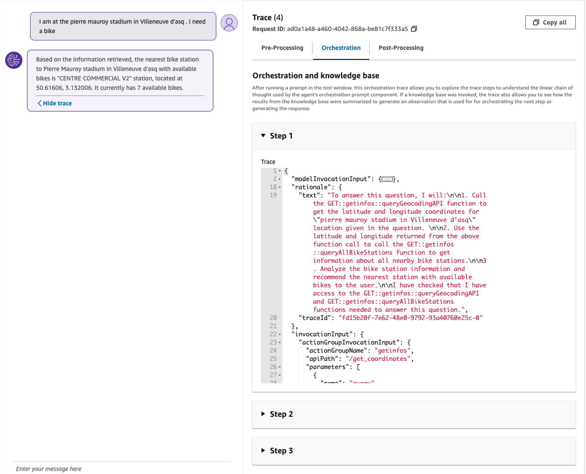
</p>


## Agents for Bedrock Setup


### Setting up Action Group

Before you create your agent, you should set up action groups and knowledge bases that you want to add to your agent.

* Action groups define the tasks that you want your agent to help customers carry out.

Knowledge bases provide a repository of information that the agent can query to answer customer queries and improve its generated responses. For more information, see Knowledge base for Amazon Bedrock.

An action group consists of the following components that you set up.

* An OpenAPI schema that define the APIs that your action group should call. Your agent uses the API schema to determine the fields it needs to elicit from the customer to populate for the API request.

* A Lambda function that defines the business logic for the action that your agent will carry out.


* **API Schema**:
When you create an action group, you must define the APIs that the agent can invoke with an OpenAPI schema in JSON or YAML format. You can create OpenAPI schema files yourself and upload them to Amazon S3 buckets, or you can use the OpenAPI text editor in order to easily validate your schema. The text editor is available after you create the agent. You can use the text editor when you add an action group to an agent or edit an existing one (for more information, see Manage your agent ).

The following is the general format of an OpenAPI schema for an action group.

Minimally, each method requires:

* description – A description of the API operation. Use this field to inform the agent when this API should be called and what it does.
* responses – The properties defined for the operation response are not just used for constructing prompts. They are used for accurately processing the results of an API call, and for determining a proper set of steps for carrying out a task. By knowing the response coming back from one operation, the agent can know that those values can be used as inputs for subsequent steps in the process.

The Lambda containing the logic that will be executed by the agent and The openAPISpec documentation that will tell the agent which functions to call 
Upload it to a S3 bucket. 


### Lambda Deployment

When creating an Action group, you need to define a Lambda function to program the business logic for your action group and to customize how you want the API response to be returned. You use the variables from the input event to define your functions and return a response to the agent. To write your function, you will need to understand the format of the input event and expected response. You must attach a resource-based policy to your Lambda function. For more information about resource-based policies in Lambda, see Using resource-based policies for Lambda .  

Create the function the agent will use to retrieve data and call the different API.
We need the geoloc API call to get the exact locations. In this example we are using locationiq.com but you can use a geolocation service of your own.

We need the current status and the short temporal status from the garnet Framework

#### Lambda deployment with SAM

In this tutorial , we are using SAM to deploy this lambda but you can of course choose your preferred/usual way (console/CDK/terraform)

Get a api key from the location service use in this example and replace it the `get_info/app.py` file
```
line 100:
url = f'https://us1.locationiq.com/v1/search?key=KEY&q=${location_name}&format=json'
```

```
sam init

You can preselect a particular runtime or package type when using the `sam init` experience.
Call `sam init --help` to learn more.

Which template source would you like to use?
        1 - AWS Quick Start Templates
        2 - Custom Template Location
Choice: 1

Choose an AWS Quick Start application template
        1 - Hello World Example
        2 - Data processing
        3 - Hello World Example with Powertools for AWS Lambda
        4 - Multi-step workflow
        5 - Scheduled task
        6 - Standalone function
        7 - Serverless API
        8 - Infrastructure event management
        9 - Lambda Response Streaming
        10 - Serverless Connector Hello World Example
        11 - Multi-step workflow with Connectors
        12 - GraphQLApi Hello World Example
        13 - Full Stack
        14 - Lambda EFS example
        15 - Hello World Example With Powertools for AWS Lambda
        16 - DynamoDB Example
        17 - Machine Learning
Template: 1

Use the most popular runtime and package type? (Python and zip) [y/N]: y

Would you like to enable X-Ray tracing on the function(s) in your application?  [y/N]: 

Would you like to enable monitoring using CloudWatch Application Insights?
For more info, please view https://docs.aws.amazon.com/AmazonCloudWatch/latest/monitoring/cloudwatch-application-insights.html [y/N]: 

Would you like to set Structured Logging in JSON format on your Lambda functions?  [y/N]: 

Project name [sam-app]: vlilleAgent

    -----------------------
    Generating application:
    -----------------------
    Name: vlilleAgent
    Runtime: python3.9
    Architectures: x86_64
    Dependency Manager: pip
    Application Template: hello-world
    Output Directory: .
    Configuration file: vlilleAgent/samconfig.toml
    
    Next steps can be found in the README file at vlilleAgent/README.md
        

Commands you can use next
=========================
[*] Create pipeline: cd vlilleAgent && sam pipeline init --bootstrap
[*] Validate SAM template: cd vlilleAgent && sam validate
[*] Test Function in the Cloud: cd vlilleAgent && sam sync --stack-name {stack-name} --watch
```


### Bedrock Agent configuration

* Unblock model access

First unblock model access. We use anthropic for this tutorial. Click on save

* Enable the desired model in the console: https://us-east-1.console.aws.amazon.com/bedrock/home?region=us-east-1#/modelaccess

<p>
    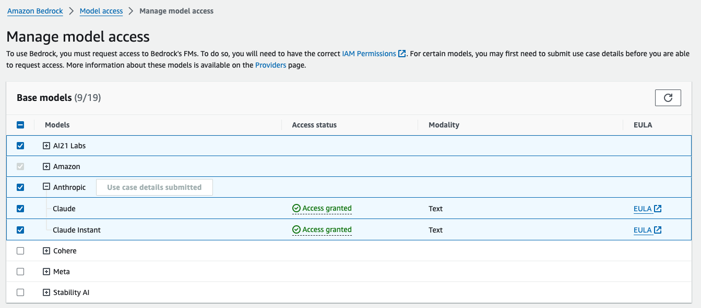
</p>


* Heads to the Agents menu and select Create Agent:

<p>
    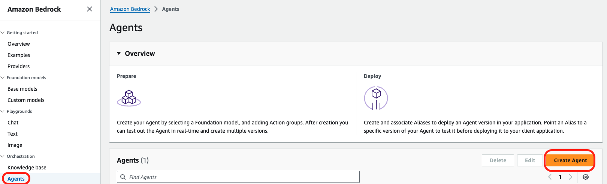
</p>


* Enter an agent Name and description and leave the default selection for the other options:

<p>
    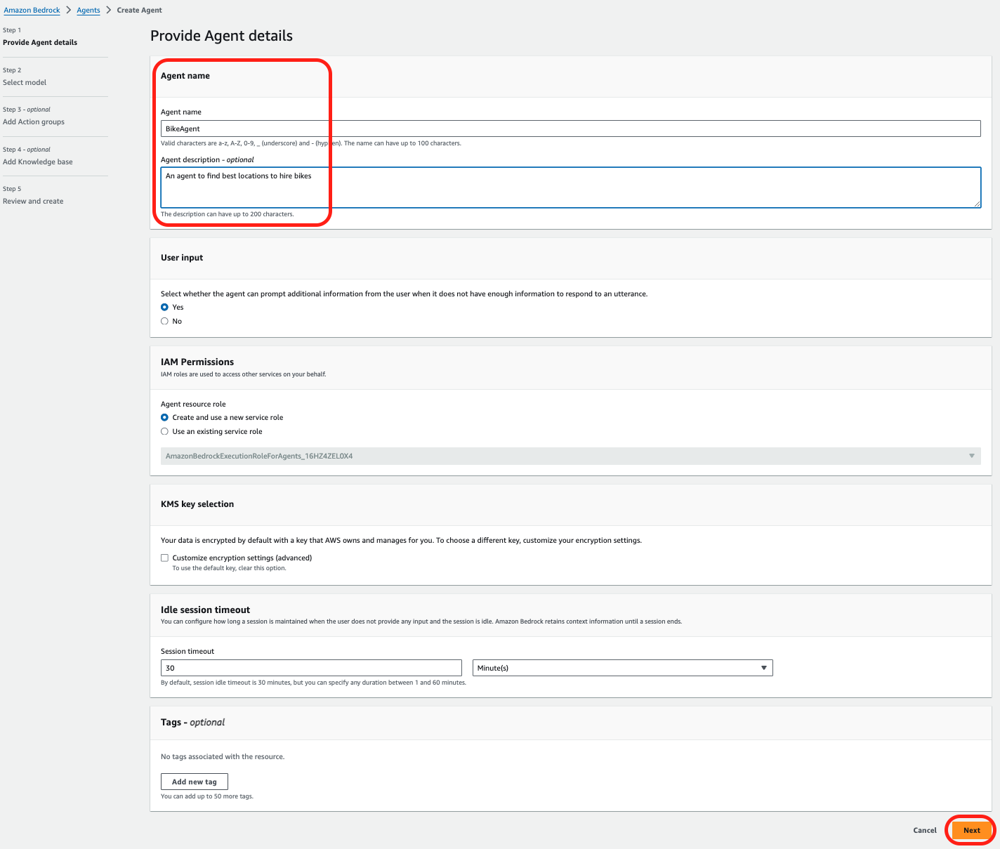
</p>


* For the model selection (our reasoning agent) , choose Anthropic Claude Instant V1. Why? It is a faster and cheaper yet still very capable model.

For the instruction we need to tell the agent how to behave:You can of course customize to suit you needs.

```
You are a bike Hire Agent in Lille, a city in north of france. The name of the company renting bikes is called "Vlille". You receive users question about from where to grab bikes and where to give it over, and you give advice on which bikes station to use depending on bikes availability and distance (in a 200 meters range).  
You convert location(the from and where) to GPS coordinates natively without asking the user. If the location entered by the user is in english, try to translate it to french before using the geocoding API.
Always tries to find the nearest station with available bikes , use the /get_all_stations endpoint for this.
Dont answer with technical details like code, or coordinates. Answer in a natural way.
```

* Then select **Next**:

<p>
    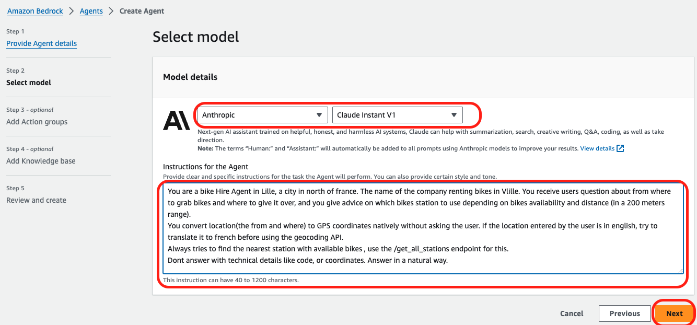
</p>


* Add an Action Groups:  
Action groups are tasks that the Agent can perform autonomously. Provide Lambda functions which represents the business logic and the related API schema to execute that logic. 

* Enter an Action Group Name   
* Select the Lambda you created previously  
* Select the API Schema (S3 bucket) you created  
* Click **Next**

<p>
    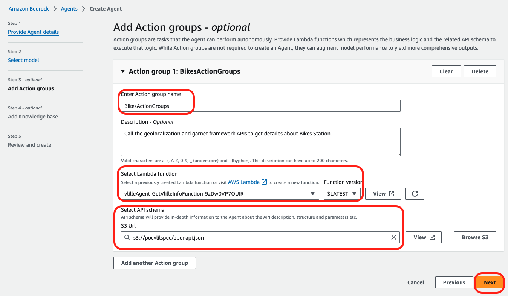
</p>


Add Knowledge base
Skip this section, it is optional and we don’t use it as part of this tutorial . However it can be really usefull for some other use case;
For now just select next to skip it

<p>
    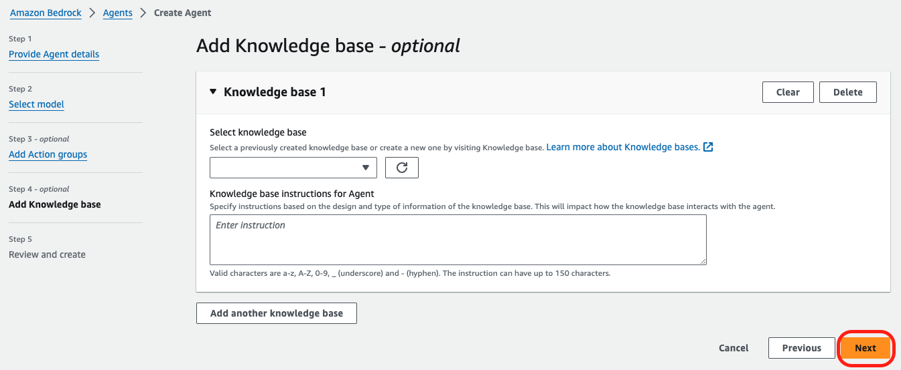
</p>


* Review and select Create Agent:

<p>
    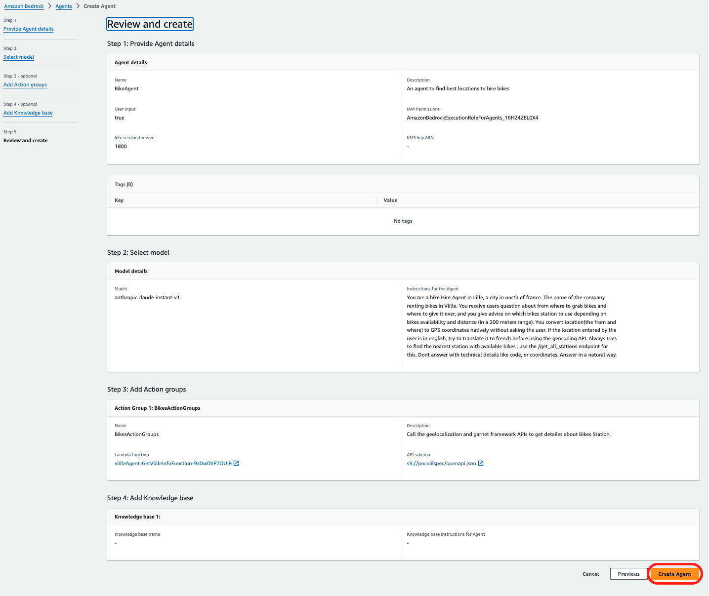
</p>


* Once the agent is created copy the agent ARN , it will be needed in to give right resource Based policy to lambda

<p>
    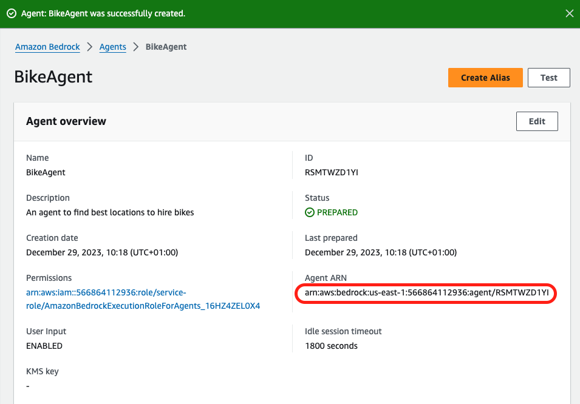
</p>


* Before testing it, it will need a resource based policy on your lambda, in order for the bedrock agent to call it
Go to the lambda console and give the necessary Resource-base policy statements permissions

<p>
    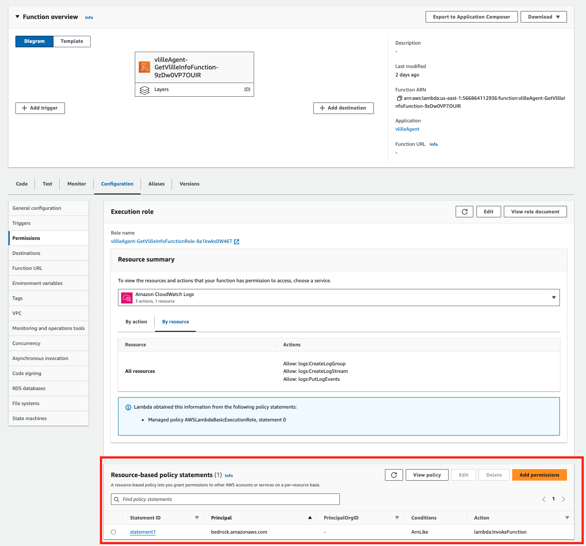
</p>


```
{
  "Version": "2012-10-17",
  "Id": "default",
  "Statement": [
    {
      "Sid": "statement1",
      "Effect": "Allow",
      "Principal": {
        "Service": "bedrock.amazonaws.com"
      },
      "Action": "lambda:InvokeFunction",
      "Resource": "arn:aws:lambda:us-east-1:56686xxxxxxx:function:vlilleAgent-GetVlilleInfoFunction-9zDw0VP7OUIR",
      "Condition": {
        "ArnLike": {
          "AWS:SourceArn": "arn:aws:bedrock:us-east-1:56686xxxxxxx:agent/8YTZExxxx"
        }
      }
    }
  ]
}
```

* Now we should be able to test out agent, go back to the Bedrock agent screen, and start asking questions in the test panel:
Here some questions:

<p>
    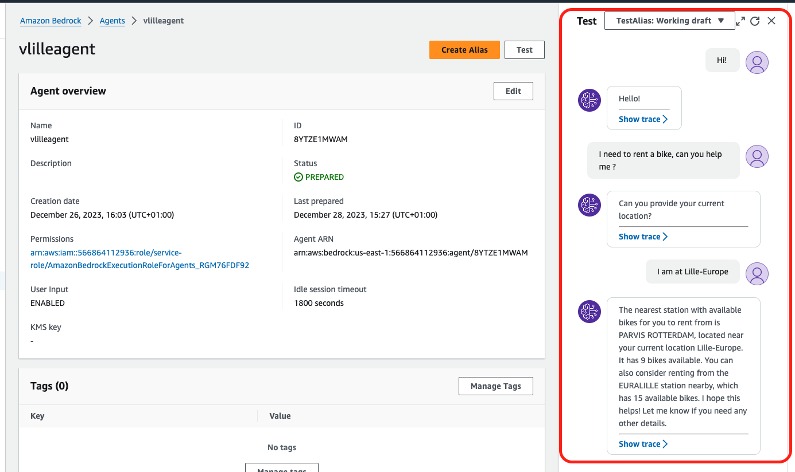
</p>


* You can click on the show trace button and you will be able to see the rational/reasoning of the model

<p>
    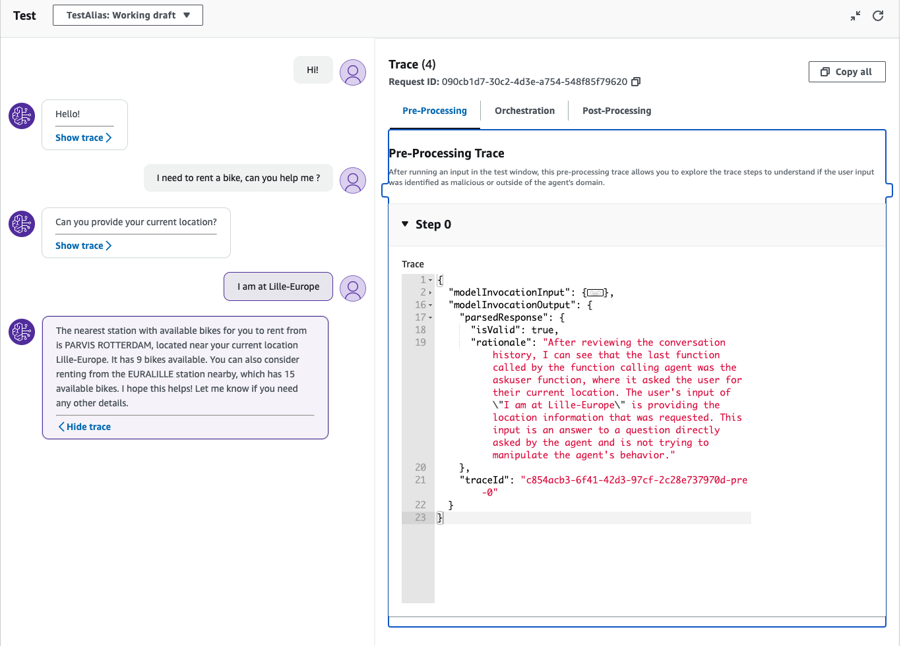
</p>

<p>
    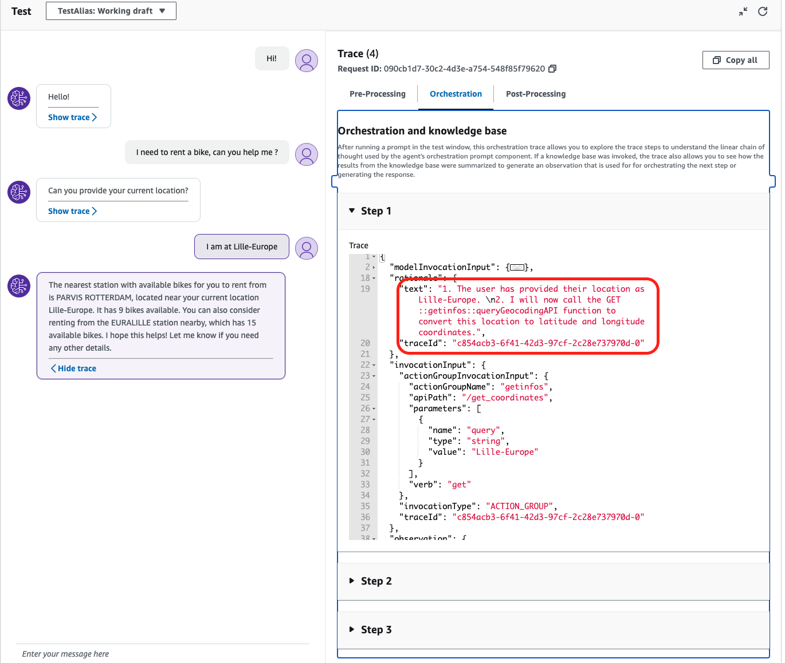
</p>

